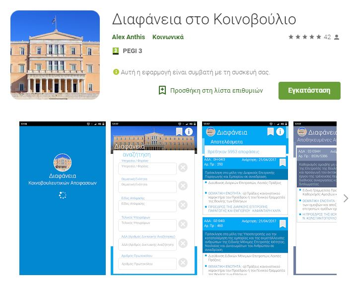

# Parliamentary Decision Documents - Android Application  

This project was conducted over the half year period of my internship in June 2016. Working as an Android Developer I took on and completed 
the development of the Hellenic Parliament Transparency application on Android enviroment. The application allows users to review up-to-date parliamentary
decisions regarding Hellenic Parliament's work on its management and administration, the preparation and implementation of its budget, 
its supplies and staff matters. You can find the current version the application on [Google Play Store](https://play.google.com/store/apps/details?id=com.alex.diafaneia&hl=el)

## Overview

<a href="https://play.google.com/store/apps/details?id=com.alex.diafaneia&hl=el"> 

</a>

### The application features: 
* MVC model programming
* Client-Server communication
* REST API
* JSON data manipulation
* Native Realm database
* SSL data encryption
      
### Prerequisites

* Android 4.1 and upwards 

## Built With

* [Android Studio](https://developer.android.com/studio) - The IDE used
* [Maven](https://maven.apache.org/) - Dependency Management
* [Realm](https://realm.io/products/realm-database/) - Local Database Management System

## Authors

* **Alex Anthis** - *Parliamentary Decision Documents - Android Application* - [AlexAnth](https://github.com/AlexAnth)

